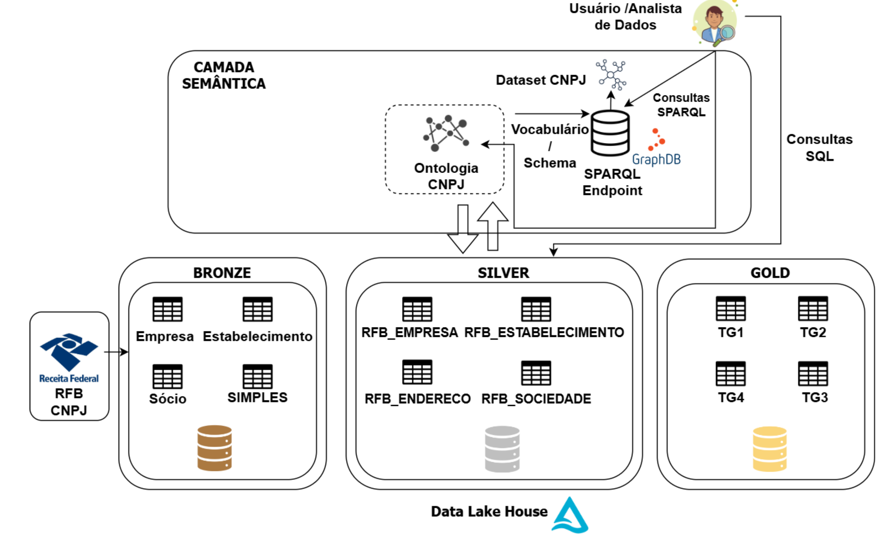
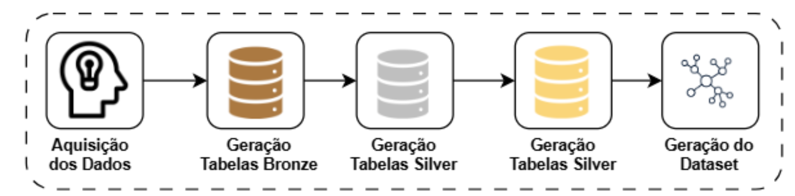
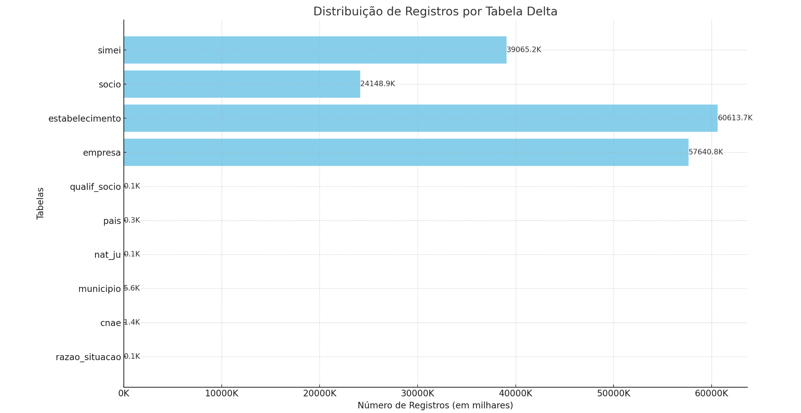
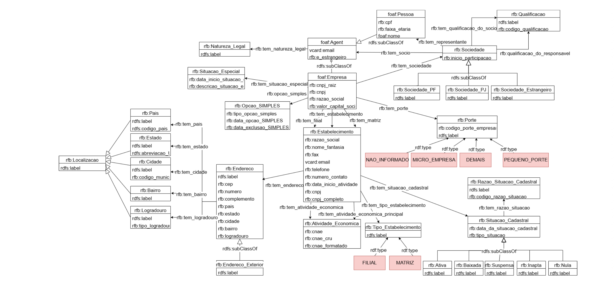
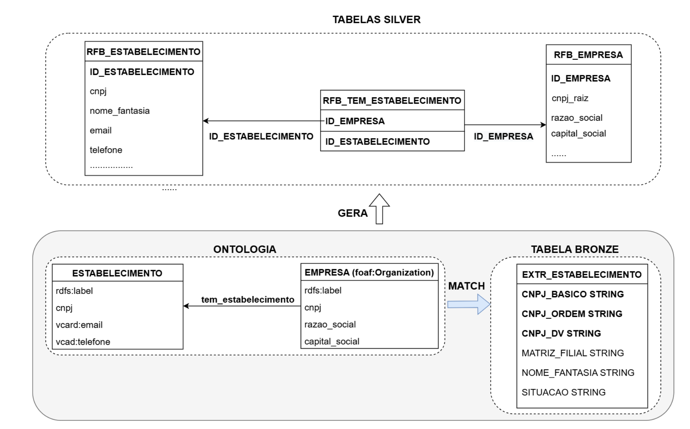

**Proceedings of the VI Dataset Showcase Workshop (DSW)**  
**October 2024 – Florianópolis, SC, Brazil**

---

# Construção do Dataset Semântico de Pessoas Jurídicas

**Autores:**
- **Tulio Vidal Rolim**1,2 · **Caio Viktor Silva Avila**1 · **Renato Freitas**1 · **Roberval Gomes Mariano**1 · **Vania Maria Ponte Vidal**1

**Afiliações:**
1. Department of Computing – Federal University of Ceará (UFC), Fortaleza – CE – Brazil
2. Instituto Federal de Educação, Ciência e Tecnologia do Piauí (IFPI)

**Contato:** {tulio.xcrtf, arlaass, jrenatosfreitas, mariano.rgm1, vania.pvidal}@gmail.com

---

## Abstract

The Federal Revenue of Brazil provides registration data on compa- nies, establishments and corporate bodies through the National Register of Le- gal Entities (CNPJ), serving as a reliable and accessible source of data. Howe- ver, obtaining and managing this data is not a trivial task. This work carries out the first initiative to build a semantic *dataset* (*DS*) of Legal Entities based on a Data Lakehouses and semantics architecture. Throughout this article, the *dataset* construction process is described, also providing the resources, scripts and artifacts used, as well as an exploration through GraphDB and presentation of possible use cases.

## Resumo

A Receita Federal do Brasil disponibiliza dados cadastrais de em- presas, estabelecimentos e quadros societários através do Cadastro Nacional de Pessoas Jurı́dicas (CNPJ), servindo como uma fonte de dados confiável e acessı́vel. Entretanto, obter e gerenciar esses dados não é uma tarefa tri- vial. Esse trabalho realiza a primeira iniciativa para construção de um da- taset semântico (DS) de Pessoas Jurı́dicas baseado em uma arquitetura de Data Lakehouses e semântica. No decorrer deste artigo é descrito processo de construção do dataset, fornecendo também os recursos, scripts e artefatos utilizados, além de uma exploração através do GraphDB e apresentação de possı́veis casos de uso.

---

1. Introdução
Nos últimos anos, com o aumento da quantidade de dados públicos disponı́veis, também
houve um aumento na necessidade de integrar dados advindos de fontes distintas e com
formatos heterogêneos.
         Considerando dados públicos, os dados de pessoas jurı́dicas são uma importante
fonte para questões fiscais, sendo essenciais para diagnosticar eventuais irregularidades,
auxiliando na descoberta de ações não saudáveis por parte de empresas no âmbito público.
Trabalhos como os de [de Oliveira Araújo et al. 2015], [Nascimento 2017] demonstram
esforços para gerenciar e representar a crescente quantidade de coleções de dados públicos
através de uma semântica bem definida na melhoria do processo de descoberta de conhe-
cimento.
         O Cadastro Nacional de Pessoas Jurı́dicas (CNPJ) da Receita Federal do Bra-
sil (RFB) disponibiliza dados cadastrais de empresas, estabelecimentos e quadros so-
cietários, servindo como uma fonte de dados confiável e acessı́vel. Entretanto, obter e
gerenciar esses dados não é uma tarefa trivial.

        Nesse sentido, o *Data Lakehouse* emerge como uma arquitetura de dados inovadora, combinando as vantagens dos *data lakes* e *data warehouses* para fornecer uma camada de armazenamento unificada, eficiente e gerenciável. Um dos principais benefícios
do *Data Lakehouse* é o suporte a transações ACID (Atomicidade, Consistência, Isola-
mento e Durabilidade), que assegura operações de leitura e escrita confiáveis e consisten-
tes, mesmo em ambientes de alta concorrência [Cherradi 2024].
         O conceito de *Data Lakehouse* foi introduzido para abordar as limitações dos *Data
Lakes* e *Data Warehouses*, já que o primeiro, embora sejam altamente escaláveis e capazes
de armazenar dados em qualquer formato, muitas vezes sofrem com a falta de governança
e qualidade de dados. Por outro lado, os *Data Warehouses* fornecem uma estrutura mais
rı́gida e eficiente para consultas, porém não conseguem lidar com a variedade e volume
de dados [Armbrust et al. 2021].
         Além disso, utilizar esses dados em conjunto com tecnologias semânticas e grafos
de conhecimento facilita o tratamento de grandes conjuntos de dados, proporcionando
uma visão unificada e permitindo integrações com outras fontes e *datasets*. Em conjunto,
tecnologias semânticas possibilitam a criação de conhecimento explı́cito a partir de dados
implı́citos, possibilitando o uso de *reasoners*, que inferem novos fatos com base em regras
predefinidas, sendo possı́vel derivar novas relações e *insights* [Ehrlinger and Wöß 2016].
        Esse trabalho realiza a primeira iniciativa para construção de um *dataset*
semântico (*DS*) de Pessoas Jurı́dicas baseado em uma arquitetura de *Data Lakehouses*
https://github.com/semantic-ekgraphs/dataset-semantico-pj.
       As principais contribuições deste artigo são: i) Proposta de Arquitetura baseada
em um *Data Lakehouse* e semântica para geração de um *dataset*; ii) Uma metodologia
para a aquisição e o armazenamento de dados do Cadastro Nacional de Pessoa Jurı́dica
(CNPJ); iii) *Dataset* semântico do CNPJ;

2. Descrição da Fonte de Dados Aberta (RFB)
A Receita Federal do Brasil (RFB), ou Secretaria Especial da Receita Federal do Brasil,
é um órgão que tem como responsabilidade a administração dos tributos federais e o
controle aduaneiro, além de atuar no combate à evasão fiscal (sonegação), contrabando,
descaminho, contrafação (pirataria) e tráfico de drogas, armas e animais.
        A RFB é fonte de dados primária responsável por fornecer a informação fidedigna
de CPFs e CNPJs. Logo, uma empresa que não tem CNPJ cadastrado na RFB é, então,
uma empresa de fato, mas não de direito, já que estará fazendo exercı́cio ilegal das suas
atividades. Os dados do Cadastro Nacional de Pessoa Jurı́dica da RFB, fonte de dados
alvo deste trabalho, são disponibilizados no [link1](https://tinyurl.com/44z6xkk9) e o Layout oficial dos dados no [link2](https://www.gov.br/receitafederal/dados/cnpj-metadados.pdf).

Além das informações de pessoa jurídica (empresa e estabelecimento), também são fornecidos dados sobre o quadro societário e de tabelas complementares, como: Tabela de Qualificações, Naturezas Legais, [Simples Nacional/MEI](http://200.152.38.155/CNPJ/Simples.zip) e [Razão de Situação Cadastral](http://200.152.38.155/CNPJ/Motivos.zip).

**Referências dos links:**
1. Dados CNPJ: https://tinyurl.com/44z6xkk9
2. Layout oficial: https://www.gov.br/receitafederal/dados/cnpj-metadados.pdf
3. Simples Nacional/MEI: http://200.152.38.155/CNPJ/Simples.zip
4. Motivos/Razão Situação Cadastral: http://200.152.38.155/CNPJ/Motivos.zip

        A fonte de dados do CNPJ é disponibilizada em formato compactado .zip e cada
um dos conjuntos de dados possui entre 1 até 10 arquivos. Ressalta-se que os arquivos são
armazenados em CSV, mas sua identificação/nome não apresenta o arquivo já renomeado
na extensão, exemplo: <F.K03200$Z.D40608.MOTICSV>. A Tabela 1 apresenta uma
visão dos dados em formato de origem .zip. Abaixo é disposto um resumo descritivo da
fonte de dados do CNPJ.

           Conceito                                        Arquivos
                             <Empresas0.zip,Empresas1.zip,Empresas2.zip,Empresas3.zip,
 Empresas                    Empresas4.zip,Empresas5.zip,Empresas6.zip,Empresas7.zip,
                             Empresas8.zip,Empresas9.zip>
                             <Estabelecimentos0.zip,Estabelecimentos1.zip,Estabelecimentos2.zip,
                             Estabelecimentos3.zip,Estabelecimentos4.zip,Estabelecimentos5.zip,
 Estabelecimentos
                             Estabelecimentos6.zip,Estabelecimentos7.zip,Estabelecimentos8.zip,
                             Estabelecimentos9.zip>
                             <Socios0.zip,Socios1.zip,Socios2.zip,Socios3.zip,Socios4.zip,
 Sócios
                             Socios5.zip,Socios6.zip,Socios7.zip,Socios8.zip,Socios9.zip>
 Simples/MEI                 <Simples.zip>
 Atividades Econômicas      <Cnaes.zip>
 Natureza Legal              <Naturezas.zip>
 Paı́ses                     <Paises.zip>
 Municı́pios                 <Municipios.zip>
 Razão Situação Cadastral <Motivos.zip>
 Qualificações             <Qualificacoes.zip>
                          Tabela 1. Visão dos dados em formato de origem.

       Esses arquivos são de extrema importância para diversas análises econômicas e
administrativas. Nesse sentido, apresenta-se uma análise exploratória dos arquivos CSV
do CNPJ com base em um conjunto de dados atualizado em 28 de junho de 2024. A
Tabela 2 apresenta a listagem dos arquivos csv e suas respectivas descrições.

 Arquivo              Descrição
                      Contém a descrição das situações cadastrais das empresas, indicando as razões
 MOTI.CSV
                      pelas quais uma empresa pode estar ativa, inativa, entre outras situações;
                      Contém a Classificação Nacional de Atividades Econômicas,
 CNAE.CSV
                      categorizando as atividades econômicas exercidas pelas empresas;
                      Lista os municı́pios brasileiros, servindo de referência geográfica para
 MUNIC.CSV
                      os endereços das empresas;
                      Classifica as empresas segundo sua natureza jurı́dica, como sociedade
 NATJU.CSV
                      anônima, limitada, entre outras;
 PAIS.CSV             Relaciona os paı́ses de origem ou atuação das empresas;
 QUALS.CSV            Descreve as qualificações dos sócios das empresas;
 SIMPLES.CSV          Relaciona os microempreendedores individuais cadastrados no Simples Nacional;
 Arquivos             Inclui informações detalhadas sobre as empresas, como razão social,
 EMPRE.CSV            CNPJ, entre outras;
 Arquivos
              Detalha os sócios, qualificações e participações;
 SOCIO.CSV
 Arquivo      Contém informações sobre os estabelecimentos das empresas, seus
 ESTABELE.CSV endereços e atividades;

                          Tabela 2. Visão dos dados em formato de origem.

3. Metodologia para Construção do *Dataset* Semântico
O uso de Delta Lake apresenta-se como uma solução robusta para muitos dos desafios
enfrentados pelos *Data Lakes* tradicionais [Armbrust et al. 2020]. Nesse sentido, Delta
Lake é uma *framework* de armazenamento que permite a criação de Delta Tables, propor-
cionando Transações ACID, Data History, Change Data Feed, Otimização Automática,
Schema Evolution e Gerenciamento de Dados Não Estruturados [Haelen and Davis 2023].
Essa solução trata o fluxo dos dados e organiza-o na arquitetura Medallion, também co-
nhecida como arquitetura de camadas, um design adotado pelo Delta Lake para organizar
dados de forma hierárquica e incremental, visando melhorar a qualidade dos dados e a
eficiência das consultas, sendo essa uma abordagem amplamente utilizada em arquitetu-
ras de *Data Lakehouse* [Databricks 2021].
        A arquitetura geral adotada para construção do *dataset* do Cadastro Nacional de
Pessoas Jurı́dicas com base em um *Data Lakehouse* Semântico é apresentada na Figura
1. Essa arquitetura serve para nortear a metodologia para desenvolvimento do *dataset*
deste trabalho. Na arquitetura apresentada, o *Data Lakehouse* é estruturado através do
uso do Delta Lake. Ainda, a arquitetura utilizada como base é flexı́vel e segue esquemas
semanticamente coerentes, isto é, possibilitando que desenvolvedores, ainda não familia-
rizados com tecnologias semânticas, possam alternativamente realizar consultas em SQL
ou desenvolver aplicações com os dados do CNPJ diretamente através das tabelas delta.

Figura 1. Arquitetura base para Geração do Dataset.

Para construção do *dataset*, a metodologia proposta é organizada da seguinte
forma conforme (Figura 2): i) Aquisição dos dados; ii) Geração das Tabelas Bronze;
iii) Geração das Tabelas Silver; iv) Geração das Tabelas Gold; v) Geração do *Dataset*.

Figura 2. Metodologia para Construção do *Dataset* Semântico.

3.1. Etapa 1: Aquisição dos dados
A primeira etapa do script Python5 consiste no download de arquivos .zip. Em seguida,
o conteúdo de cada arquivo é extraı́do no diretório data/<concept>, onde <concept>
corresponde ao nome do conceito relacionado ao arquivo, e.g Paises.zip é extraı́do em
data/paises/. Durante o processo, os arquivos são renomeados com a extensão .csv,
pois, originalmente, eles são disponibilizados com o texto ”CSV”ao final do nome,
sem a extensão adequada. Exemplo: F.K03200$Z.D40608.PAISCSV é renomeado para
F.K03200$Z.D40608.PAIS.CSV.
        Durante o download dos dados, todo o processo tem seu log salvo em um arquivo
json (download data.json) contendo informações como: [data de download dos arqui-
vos, nome, tamanho em bytes]. O script de aquisição dos dados também lida com a
manutenção de versões anteriores, logo quando há verificação de que os dados disponi-
bilizados no repositório ultrapassam a data de 30 dias, os dados atuais são movidos para
um novo diretório chamado data old/ e os novos dados são salvos em data/.
3.2. Etapa 2: Geração das Tabelas Bronze
Esta etapa é iniciada com a ingestão dos dados. Durante o processo de ingestão, há uma
classificação dos dados por conceitos existentes na ontologia, como Estabelecimentos,
Sócios e Empresas. Essa classificação facilita o processo de carga das tabelas de extração.
       Para tanto, o script6 de construção dessas tabelas segue o esquema de cada arquivo
.CSV do CNPJ, garantindo conformidade com os dados disponibilizados originalmente,
focando na carga direta, economizando tempo na ingestão dos dados. A Figura 3 apre-
senta uma análise exploratória das tabelas bronze geradas.

Figura 3. Distribuição de registros por tabela.

3.3. Etapa 3: Geração das Tabelas Silver
Nesta etapa, as tabelas bronze são tratadas por meio de diversas transformações e enri-
quecimentos para normalizar e facilitar o uso dos dados do CNPJ, como:
     1. Criação de identificadores homogêneos, e.g: o identificador de CNPJ de cada
        estabelecimento é composto por 3 campos (CNPJ BASICO, CNPJ ORDEM,
        CNPJ DIV) sendo necessário sempre realizar a concatenação para consultas que
        envolvam estabelecimento. Dessa forma foi gerado um campo único: CNPJ;
[^5]:
       https://tinyurl.com/ye26w3my
[^6]: https://tinyurl.com/s3hp8vwh

       2. Padronização de formatos de datas e números em todas as tabelas;
       3. Adição de valores textuais para campos em “flag” para prover maior significado
          aos dados, e.g: uma Situação Cadastral representada por valor 02 no campo
          est.SITUACAO passa a ter também o valor ‘ATIVA’;
       4. Integração dos dados de empresa com as tabelas de estabelecimento, socio, qua-
          lif socio e nat ju para criar uma visão completa da estrutura empresarial;
   5. Inclusão de novas *Delta Tables* para representação de conceitos derivados, e.g. (**RFB_SOCIEDADE_COM_PESSOA_FISICA**, **RFB_SOCIEDADE_COM_HOLDING**, **RFB_SOCIEDADE_COM_ESTRANGEIRO**), essas tabelas facilitam e simplificam a relação entre Sócios
          e Empresas, já que demandam de junção entre o `CNPJ_BASICO` das tabelas de
          Empresas e Sócio, não havendo o conceito de sociedade / quadro societário.
       6. Criação das tabelas delta de relação 1 pra N;
        A geração das tabelas silver consiste no processo de normalização dos dados con-
tidos nas tabelas bronze. Para tanto, para possibilitar uma maior semântica, essa etapa
é guiada com base no uso de ontologias, garantindo uma organização conceitual, assim
como provendo a diminuição do “gap” semântico entre o esquema das tabelas e mapea-
mentos para o modelo RDF [Bertails and Prud’hommeaux 2011].
Primeiro, uma ontologia foi modelada conceitualmente baseada no Layout de dados, seguindo a estrutura de um diagrama de classe, conforme **Figura 4. Modelo Ontológico do CNPJ da RFB** (vide link[^7]).

Figura 4. Modelo Ontológico do CNPJ da RFB.

        Segundo, é feito o “matching” do esquema das tabelas bronze com as classes e
propriedades da ontologia projetada. Essa estratégia tem a semântica refletida a partir
da lógica de mapeamentos diretos, removendo a complexidade pertencente às tabelas
[W3C 2012a]. Onde se adotam as heurı́sticas:
        • Classe: É mapeada como uma tabela;
[^7]: https://tinyurl.com/2e29jmhw

      • Data Type Property: É mapeada para um atributo da tabela pivot;
      • Object Type Property: Mapeia chaves estrangeiras na tabela Pivot;
      • URIs: São usados como identificadores dos recursos nas tabelas;
       Por fim, baseado no resultado do “matching”, obtém-se o esquema normalizado
de cada tabela delta silver. Salienta-se que esse processo foi realizado de forma manual.
A Figura 5 apresenta uma representação da definição do esquema das tabelas silver.

Figura 5. Processo de Matching entre a Ontologia e as Tabelas do Delta Lake.

       O processo de povoamento dos dados das tabelas silver baseia-se no uso funções
que consultam as tabelas bronze, checam a consistência dos registros retornados, e os
armazenam nas tabelas normalizadas (silver). Nessa etapa, essas funções usaram a lin-
guagem .SQL para realizar consultas nas tabelas da camada bronze de modo a facilitar a
compreensão e uso.

3.4. Etapa 4: Geração das Tabelas Gold
Ao utilizar a arquitetura Medallion no Delta Lake, podemos criar tabelas Gold que agre-
guem dados a partir dessa base, oferecendo *insights* valiosos para diversos *stakeholders*.
A seguir, são especificadas quatro tabelas Gold construı́das, cada uma com foco em as-
pectos especı́ficos dos dados do CNPJ.
      • Empresas e Atividades Econômicas (TG1): Esta tabela consolidará informações
        sobre as empresas, categorizadas por suas atividades econômicas principais. Inclui
        dados sobre o número de empresas por setor econômico, receitas anuais, número
        de funcionários, entre outros;
      • Distribuição por Estado (TG2): Esta tabela agrega dados das empresas por es-
        tado, proporcionando uma visão geográfica da distribuição empresarial no Bra-
        sil. Inclui informações sobre a densidade empresarial, receitas e atividades
        econômicas predominantes em cada estado;
      • Evolução Temporal (TG3): Apresenta como o número de empresas e suas carac-
        terı́sticas mudaram ao longo dos anos. Essa tabela é alimentada pela captura do
        histórico das delta tables e do data change feed. Inclui informações históricas anu-
        ais sobre novos registros, encerramentos e mudanças em atividades econômicas;

       • Sócios das Empresas (TG4): Esta tabela categoriza quadro societários com
         informações agrupadas por sociedade e e sócios, permitindo identificar aspec-
         tos como: qualificação, representante, data de entrada e por exemplo, todas as
         relações de quadro societário desse sócio nas variadas empresas.
3.5. Etapa 5: Geração do *Dataset*
O *dataset* semântico (*DS*) gerado neste trabalho consiste em um grafo RDF que utiliza
o mesmo vocabulário/*schema* da ontologia apresentada na subseção 3.3. Logo, um *DS*
é uma visão RDF materializada, sendo esta definida por um conjunto de mapeamentos
que relacionam os termos do esquema da fonte de dados aos termos da ontologia. Esses
mapeamentos são mapeamentos diretos a partir das Delta Tables. Adotando esse padrão,
o esquema e a complexidade contidas nos mapeamentos são refletidas diretamente a partir
das tabelas normalizadas silver.
         Nesse estágio, foi desenvolvido um script8 para geração do *DS* utilizando um
arquivo de mapeamento9 como entrada lógica para geração das triplas. Esse mapeamento
seguiu a estrutura do R2RML [W3C 2012b] por ter sua sintaxe amplamente conhecida na
literatura. O *DS* gerado neste trabalho está disponı́vel no seguinte link10 .

4. Descrição Quantitativa do *Dataset*
A Tabela 2 apresenta uma visão geral do *dataset* construı́do, destacando três classes prin-
cipais: cnpj:Empresa, cnpj:Estabelecimento e cnpj:Pessoa. Para cada classe, são exi-
bidas a quantidade de recursos, as relações de propriedade de dados, as relações com
recursos de saı́da e as relações com recursos de entrada. A classe cnpj:Empresa contém
57.639.205 recursos, com 345.835.230 relações de propriedade de dados, 296.609.901
relações de saı́da e 24.135.831 relações de entrada.

\n
| Classe | Quantidade de Recursos | Relações de Propriedade de Dados | Relações (Links) de Saída | Relações (Links) de Entrada |
|--------|------------------------|----------------------------------|---------------------------|------------------------------|
| `cnpj:Empresa` | 57.639.205 | 345.835.230 | 296.609.901 | 24.135.831 |
| `cnpj:Estabelecimento` | 60.450.604 | 604.506.040 | 329.948.366 | 60.450.604 |
| `cnpj:Pessoa` / `cnpj:Socio` | 16.029.797 | 80.148.985 | 16.029.797 | 33.061.387 |
604.506.040 relações de propriedade de dados, 329.948.366 relações (links) de saı́da e
60.450.604 relações links de entrada. Por fim, a classe cnpj:Pessoa abrange 16.029.797
recursos, 80.148.985 relações de propriedade de dados, 16.029.797 relações de saı́da e
33.061.387 relações de entrada.

5. Exploração do Dataset
Nesta seção é apresentada em resumo uma exploração para ilustrar o uso do DS cons-
truı́do. Para tanto, foi utilizado o GraphDB 11 (podendo ser também utilizado qual-
   8
     https://tinyurl.com/bdhtp3ah
   9
     https://tinyurl.com/49tpbep5
  10
     https://tinyurl.com/mr2tkd25
  11
     https://graphdb.ontotext.com/

quer outra ferramenta semelhante de visualização / exploração). A Figura 6 apre-
senta a exploração de um recurso do tipo estabelecimento (cnpj:Estabelecimento) -
nó em vermelho, com suas respectivas propriedades: rótulo do recurso (rdfs:label),
email de contato (vcard:email), cnpj (cnpj:cnpj completo), data de inı́cio da ati-
vidade (cnpj:data inicio atividade), nome fantasia (cnpj:nome fantasia), telefone:
(cnpj:telefone).

Figura 6. Exploração Visual de um recurso do *DS*.

         Através da exploração também pode-se observar algumas relações via
object properties entre o nó do Estabelecimento e sua Situação Cadastral
(<INAPTA0022352700018520190109>), bem como seu tipo de estabelecimento
(<Matriz>). Esses tipos de relações expressam uma das possibilidades no uso de *dataset*
semântico, pois a exploração/navegação sobre um recurso/instância especı́fica a outra(a) é
feita através de arestas, tornando a navegação mais intuitiva e *user-friendly*. Além disso, a
estrutura baseada em grafo facilita a extração de *insights* significativos, pois as conexões
explı́citas entre os dados ajudam a revelar padrões e correlações que podem não ser facil-
mente visı́veis em outras formas de representação, sendo essa uma outra vantagem no uso
de *datasets* semânticos aos usuários.

6. Casos de Uso do *Dataset*
A utilização de um dataset semântico derivado do CNPJ da RFB pode atender a diversas
necessidades e aplicações estratégicas de uma Secretaria da Fazenda estadual. Esse tipo
de *dataset* facilita uma análise profunda e eficiente de informações cadastrais, promo-
vendo a detecção de inconsistências, fraudes e irregularidades, além de apoiar a tomada
de decisões estratégicas. A seguir, são discutidos alguns usos especı́ficos de um *dataset*
semântico no âmbito fiscal e cadastral.
        Monitoramento de Conformidade Fiscal: Os dados contidos no *DS* podem ser
utilizados para verificar a conformidade fiscal das empresas registradas por Secretarias da

Fazenda no estado. Isso inclui a identificação de empresas registradas no regime Simples
Nacional ou como Microempreendedores Individuais (MEI) que estejam desempenhando
atividades econômicas permitidas pela classificação CNAE. Essa verificação é essencial
para garantir a conformidade com as polı́ticas fiscais e prevenir a evasão de impostos.
        Detecção de Inconsistências Cadastrais: O DS permite identificar empresas
que compartilham as mesmas informações de contato, o que pode indicar a existência
de fraudes ou irregularidades. Além disso, facilita a detecção de empresas sem sócios
ativos ou com sócios falecidos, garantindo que apenas entidades em conformidade com
as normas legais estejam operando.
        Monitoramento de Atividades Econômicas: Com um dataset semântico, é
possı́vel monitorar empresas envolvidas em atividades econômicas incompatı́veis. Esse
monitoramento assegura que as empresas estejam operando em conformidade com as
regulamentações vigentes e não apresentem riscos à segurança pública.
         Validação de Endereços: Estabelecimentos sem endereços válidos podem ser
detectados com facilidade, garantindo que todas as empresas possuam uma localização
fı́sica verificável. Esta validação é crucial para a logı́stica, inspeção e fiscalização de
atividades comerciais.
        Análise de Capital Social e Tamanho da Empresa: Através da análise
semântica, a Secretaria da Fazenda pode identificar empresas cujo capital declarado é
inconsistente com o porte ou a atividade econômica desempenhada. Essa análise ajuda a
identificar possı́veis fraudes financeiras ou irregularidades contábeis.

7. Desafios e Limitações
A construção de um dataset para os dados do CNPJ possui um conjunto de desafios como:
i) Armazenamento de um grande volume de dados: Os dados do CNPJ totalizam mais
de 30GB somente em formato .zip e mais de 60 Milhões de registros apenas conside-
rando empresas e estabelecimento, logo demandando de espaço para armazenamento e
exigindo um considerável custo para tratamento bem como no processamento de consul-
tas; ii) tratamento dos dados limpeza e normalização: os dados do CNPJ são agrupados
em arquivos .CSV, onde alguns desses contemplam um grande conjunto de informações,
como por exemplo, os arquivos de Estabelecimento que acoplam mais de 20 atributos por
arquivo, dificultando um baixo acoplamento e dependência entre si desses dados, bem
como à resolução de identidade de novas entidades, talc como os dados de endereço.
       iii) Identidade Fraca: Alguns dos conceitos possuem identidade fraca, deman-
dando da combinação de atributos (atributos compostos), gerando uma maior complexi-
dade para se realizar junções e consequentemente dificultando a formulação e realização
de consultas. E.g um estabelecimento é definido por três campos (CNPJ BASICO,
CNPJ ORDEM e CNPJ DIV), conforme citado anteriormente na subseção 3.3
         iv) Compreensão do domı́nio: Alguns termos e conceitos do domı́nio não são
explı́citos a partir do layout de dados. Onde, para identificar a relação de um sócio com
uma empresa, i.e a definição de um quadro societário, por exemplo, faz-se necessário
identificar não só o cnpj da empresa e cpf do sócio, mas também seu nome, tendo em
vista que o cpf é anonimizado e fornece apenas os 6 dı́gitos centrais principais, sendo em
alguns casos, oportuno utilizar a qualificação do sócio.

8. Trabalhos Relacionados
Trabalhos recentes demonstram esforços para se integrar a crescente quantidade de
coleções de dados públicos. [Barbosa 2023] aborda a implementação de um *dataset*
semântico utilizando um Datalake municipal para o Rio de Janeiro, destacando sua re-
levância no setor público, principalmente em termos de escalabilidade, governança e
polı́ticas públicas, sendo potencialmente replicável em outras cidades e paı́ses.
        [Braz et al. 2023] apresenta um estudo que gerou um *dataset* de empresas relacio-
nadas a licitações públicas no estado de Minas Gerais envolvidas em fraudes ou com com-
portamentos suspeitos , sendo um dataset útil para aprimorar os mecanismos de prevenção
e controle de fraudes nos processos licitatórios.
        Por sua vez, [do Prado Pagotto et al. 2024] propõem a criação de um data lake
para armazenar e sistematizar dados de saúde no Brasil. O *dataset* gerado é composto
por informações de diferentes fontes do sistema de saúde, incluindo dados sobre pacien-
tes, atendimentos médicos, hospitais e indicadores de saúde pública, tendo como finali-
dade apoiar decisões informadas e desenvolver polı́ticas públicas mais precisas na área de
saúde.
        Tendo em vista os trabalhos anteriormente citados, podemos observar que os estu-
dos e pesquisas na área concentram-se na integração de dados governamentais e geração
de *datasets* para domı́nios como (educação, saúde, polı́ticas públicas), Já o trabalho atual
propõe a criação de um dataset semântico de Pessoas Jurı́dicas, baseado no Cadastro Na-
cional de Pessoas Jurı́dicas, diferenciando-se por tratar todo o processo para a criação
de um dataset semântico baseado em dados abertos públicos, desde sua modelagem,
representação, geração e consumo.
        Esse trabalho também adota uma arquitetura hı́brida baseada em um Data La-
kehouse, que combina aspectos de data lakes e data warehouses incorporando uma camada
semântica para enriquecer o *dataset*. Esse tipo de arquitetura para geração do dataset não
foi abordada nos trabalhos anteriores, tratando apenas de data lakes tradicionais. Ainda,
este trabalho gera diversas contribuições ao conjunto de dados original, realizando lim-
peza, tratamento e normalização aos dados, agrupando conceitos previamente complexos
bem como gerando novos, tal como citado na subseção 3.3.

9. Considerações Finais
Este artigo apresentou uma metodologia para construção de um dataset semântico DS do
Cadastro Nacional de Pessoas Jurı́dicas (CNPJ), apresentando uma arquitetura baseada
em Data Lakehouses enriquecida de semântica, fornecendo uma base teórica e prática
para a aquisição, tratamento, normalização, limpeza dos dados e geração do dataset.
        Todas as etapas da metodologia foram detalhadas, apresentando os recursos e
scripts necessários, apresentando também contribuições realizadas aos dados. Por con-
seguinte, o DS gerado é apresentado através do GraphDB , onde é apresentada uma
consulta exploratória demonstrando a visualização dos dados, propriedades e relações de
um recurso Estabelecimento.
         Ao final, este trabalho sugere além do dataset semântico gerado, uma perspectiva
na adoção de novas tecnologias como Data Lakehouse em conjunto com semântica para
geração de datasets de dados públicos, apresentando uma metodologia e detalhes de todas

as suas etapas, possibilitando que outros estudos o utilizem para geração de novos datasets
públicos nos mais variados domı́nios e contextos.
        Como trabalhos futuros pretende-se enriquecer o DS do CNPJ realizando
integrações com outros datasets relevantes como Cadastro Nacional de Atividades
Econômicas (CNAE) do IBGE, o Cadastro de Inidôneos e Suspensos (CEIS), TCU e
Portal de Compras Governamentais.

Referências
Armbrust, M., Das, T., Sun, L., Yavuz, B., Zhu, S., Murthy, M., Torres, J., van Hovell,
  H., Ionescu, A., Łuszczak, A., et al. (2020). Delta lake: high-performance acid table
  storage over cloud object stores. Proceedings of the VLDB, 13(12):3411–3424.
Armbrust, M., Ghodsi, A., Xin, R., and Zaharia, M. (2021). Lakehouse: a new generation
  of open platforms that unify data warehousing and advanced analytics. In Proceedings
  of CIDR, volume 8, page 28.
Barbosa, R. P. C. (2023). Potencializando o uso de dados em polı́ticas públicas através do
  primeiro datalake municipal no mundo no rio de janeiro. Enepcp.
Bertails, A. and Prud’hommeaux, E. G. (2011). Interpreting relational databases in the rdf
  domain. In Proceedings of the sixth international conference on Knowledge capture,
  pages 129–136.
Braz, C. S., Mendes, B. M., Oliveira, G. P., Costa, L. L., Silva, M. O., Brandao, M. A.,
  Lacerda, A., and Pappa, G. L. (2023). Análise de irregularidades em licitações públicas
  com foco em empresas de pequeno porte. In Anais do XI Workshop de Computação
  Aplicada em Governo Eletrônico, pages 94–105. SBC.
Cherradi, M. (2024). Data lakehouse: Next generation information system. In Seminars
  in Medical Writing and Education, volume 3, pages 67–67.
Databricks (2021). What is a medallion architecture. <https://www.databricks.
  com/glossary/medallion-architecture>. Acessado em: 15-07-2024.
de Oliveira Araújo, L. S., Santos, M. T., and Silva, D. A. (2015). The brazilian federal
   budget ontology: a semantic web case of public open data. In Proceedings of the 7th
   International Conference on Management of computational and collective intElligence
   in Digital EcoSystems, pages 85–89.
do Prado Pagotto, D., da Silva Marques, W., de Oliveira, D. S., Ferreira, V. d. R. S.,
  de Azevedo, V. N., and Júnior, C. V. B. (2024). Inovação em saúde: a implementação
  de um data lake para armazenamento, sistematização e disponibilização de dados em
  saúde no brasil. InCID: Revista de Ciência da Informação e Documentação, 15(1).
Ehrlinger, L. and Wöß, W. (2016). Towards a definition of knowledge graphs. SEMAN-
  TiCS (Posters, Demos, SuCCESS), 48(1-4):2.
Haelen, B. and Davis, D. (2023). Delta Lake: Up and Running. ”O’Reilly Media, Inc.”.
Nascimento, L. M. (2017). Utilizando linked data para publicação e cruzamento de dados
  governamentais abertos. Master’s thesis, Universidade Federal Fluminense.
W3C (2012a). A direct mapping of relational data to rdf.
W3C (2012b). R2rml: Rdb to rdf mapping language.

